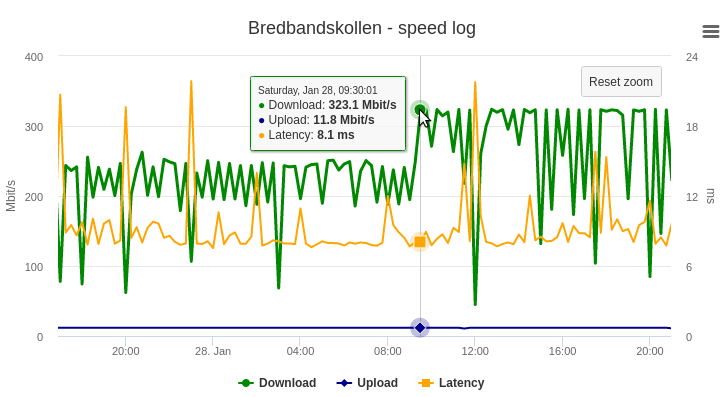

# Bredbandskollen - Log
Periodically check your Internet connection speed using
[Bredbandskollen](https://www.bredbandskollen.se/) and then display this
in a graph.



## Requirements
Docker installed.

## Config
See file `bbk-cron` on how often to run the `bbk_cli` command.
See file `config` for Docker parameters.

## Start

```shell
./build.sh           # builds Docker image
./run.sh             # locally (re)start container
```

Navigate to [http://localhost:8380](http://localhost:8380).
Wait for next crontab moment to occur and reload web page.

## Trigger reading now

```shell
source config
docker exec $CONTAINER_NAME /root/bbk-log.sh
```

## Clear log

```shell
source config
docker exec $CONTAINER_NAME /bin/bash -c "echo '' > /data/bbk.log"
```

## Deploy on remote server

```shell
source config
ssh-copy-id $REMOTE_HOST
./deploy-remotely.sh # build, transfer image and start container on remote host
```
